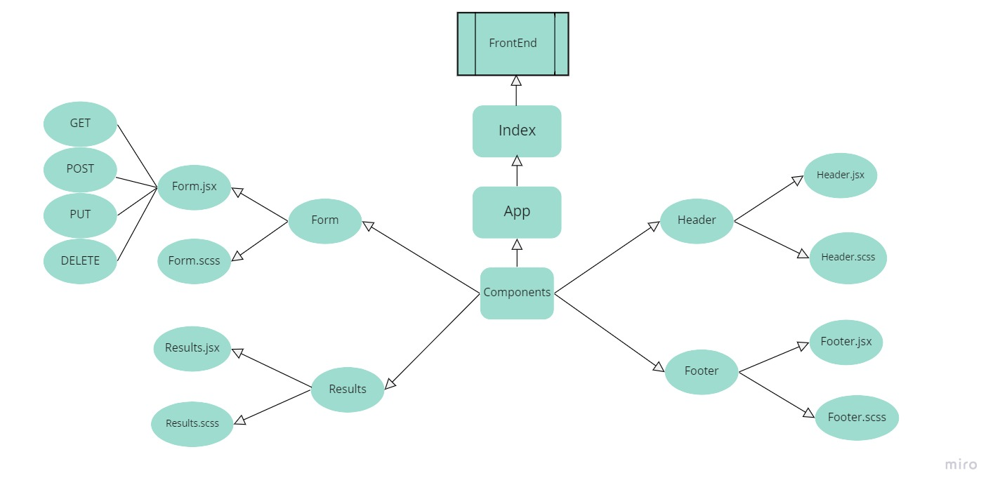

# RESTy appliction
### an API testing application, flexible to run on any browser, allows the user to easily interact  with APIs in a familiar interface.
***
### [Deployment](https://react-resty-app.netlify.app/) 

### [Pulls](https://github.com/En-ZUH/Resty/pulls) 
***
## Running script : 
   * npm start
   
***

## UML Diagram

